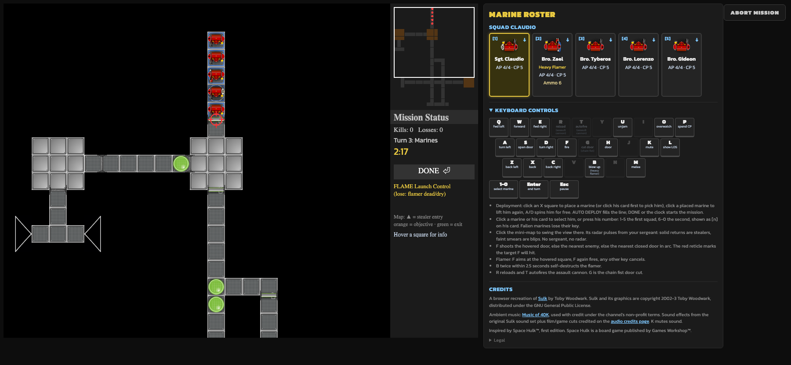
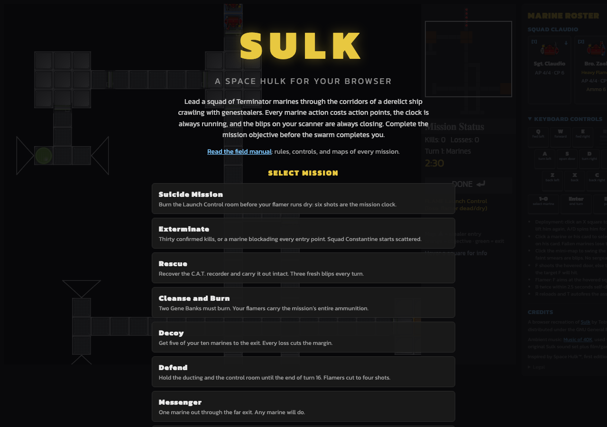

# Sulk Web

A browser port of [Sulk](https://sulk.sourceforge.net/), the open-source Space Hulk clone: turn-based squad tactics in the corridors of a derelict ship, your Terminator marines against an endless genestealer swarm. The entire original campaign is playable: nine missions transcribed from the original game's sources, with the original boards, sprites, rules, and a full soundtrack.

**▶ Play it now: <https://harryf.github.io/sulkweb/>**: no install, runs in your browser.

**📖 Read the [field manual](https://harryf.github.io/sulkweb/manual.html)**: friendly rules, controls, and a rendered map of every mission.



Built as two packages: a **pure-TypeScript rules engine** (no rendering dependencies, fully playable headless) and a **Phaser 3 client** that turns engine events into motion, sound, and UI. Deterministic dice make every game replayable, which is what makes the browser test suite possible.



## Run it locally

```bash
pnpm install
pnpm --filter ./packages/client dev   # open http://localhost:5173
```

Useful URL parameters: `?mission=beta_2` boots straight into a mission,
`?deploy=0` skips the deployment phase for quick testing.

```bash
pnpm test                              # engine + client unit suites
pnpm --filter ./packages/client e2e    # Playwright: real browser, no mocks
pnpm build                             # engine tsc + client vite build
```

## Documentation

| Page | What's in it |
|---|---|
| [docs/features.md](docs/features.md) | Every mission, the deployment phase, controls, roster panel, mini-map auspex, motion, and sound |
| [docs/rules-reference.md](docs/rules-reference.md) | The complete game rules as implemented: units, dice, doors, blips, victory conditions |
| [docs/architecture.md](docs/architecture.md) | How the engine and client fit together, the event-bus boundary, and how deploys work |
| [docs/development-guide.md](docs/development-guide.md) | Directory map and recipes for adding missions, marine types, objectives, and sounds |
| [docs/asset-index.md](docs/asset-index.md) | Every asset under `packages/client/public` and what uses it |
| [docs/status.md](docs/status.md) | Roadmap state and known gaps |
| [docs/writing-guide.md](docs/writing-guide.md) | Rules for all player-visible text |
| [docs/history/](docs/history/) | How the game was built: the milestone prompts, the Pygame analysis, and the original Sulk manual |
| [CLAUDE.md](CLAUDE.md) | Working agreements and context routing for AI-assisted development |
| [ISA.md](ISA.md) | The system of record: every verified criterion, decision, and piece of test evidence |

## Releases

The live site deploys from **version tags only**: pushing to `main` never
touches it. A tag runs the full verification gate (typecheck + all unit
suites) and, only if green, builds and publishes to GitHub Pages with the tag
as the in-game version string. Details: [docs/architecture.md](docs/architecture.md).

## License

Sulk Web is free software under the
[GNU General Public License v3.0](https://www.gnu.org/licenses/gpl-3.0.html)
(see [LICENSE](LICENSE)), the same license as the original Sulk game it
recreates. Audio and music assets carry their own licenses, credited in
[CREDITS.md](CREDITS.md) and on the deployed
[audio credits page](https://harryf.github.io/sulkweb/credits.html).
Space Hulk is a trademark of Games Workshop; this is an unaffiliated fan
recreation of the open-source Sulk clone and claims no rights over Games
Workshop's intellectual property.
