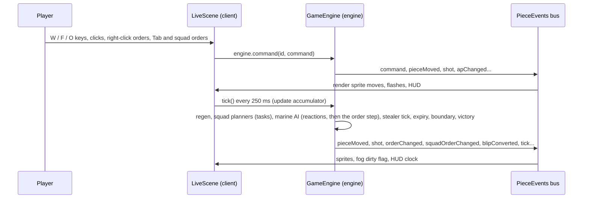

# Architecture and Deployment

How Sulk Web is put together, how the Phaser frontend and the rules engine talk to each other, and how to ship a build. For where to add new content (missions, unit types), see [development-guide.md](development-guide.md). Verified against the source on 2026-08-17; if a detail disagrees with the code, the code wins and this file needs updating.

## The one-paragraph version

Sulk Web is a pnpm monorepo with two packages and a one-way dependency: `packages/client` (Phaser 3 rendering, input, audio, DOM panels) imports `packages/engine` (a pure-TypeScript rules engine with zero rendering dependencies). There is no server and no backend: the engine runs in the browser, in the same JavaScript context as the renderer. The two halves communicate over a narrow boundary: the client calls engine methods and reads engine state; the engine broadcasts what happened on a typed event bus (`PieceEvents`). A production deploy is a static directory.

## Monorepo layout

| Path | What it is |
|---|---|
| `packages/engine/` | `@sulk/engine`: rules, board, pieces, AI, missions. Pure TypeScript, no Phaser, no DOM. |
| `packages/client/` | The playable game: Phaser 3 scenes, DOM roster panel, canvas HUD, audio. Depends on the engine. |
| `scripts/fetchAudio.ts` | Downloads and processes the music and generated sound cuts (see Deployment below). |
| `docs/` | This guide, the [development guide](development-guide.md), the [asset index](asset-index.md), the [feature tour](features.md), the [status page](status.md), the writing guide, and [history/](history/), the build story and reference material on the original game. |
| `ISA.md` | The project's system of record: every verified criterion, decision, and piece of test evidence. |

## The engine (`packages/engine`)

The engine models the complete game with no knowledge of how it will be drawn:

- `board/`: `Board`, `Square`, line of sight (`los.ts`), vision and fire arcs (`vision.ts`).
- `pieces/`: `Piece` (abstract base) and its subclasses: `StormBolterMarine` (also the base for `SergeantMarine`, `SwordSergeantMarine`), `HeavyFlamerMarine`, `AssaultCannonMarine`, `ChainFistMarine`, `Genestealer`, `Blip`, `AmbushCounter`. Pieces own their own rules: `tryMove`, `shoot`, `overwatchOn`, and so on, and emit events as they act.
- `rules/`: cross-piece rules: doors (`Door.ts`, edge-model), close combat (`combat.ts`), flame templates (`flame.ts`), exotic objects like the C.A.T. and ducting (`exotic.ts`).
- `GameEngine.ts`: turn structure. `GameEngine` owns the state, deploys the squad from mission JSON, and drives the stealer and end phases (`PhaseName` is a string union; there is no phase-class hierarchy). Missions open in a `Deploy` phase: `beginDeployment()` lifts the constructed squad into `engine.reserve` and locks the board, the client places marines through `deployMarine`/`undeployMarine`/`autoDeploy`, and `finishDeployment()` fills the rest, unlocks, and starts the marine phase. Deployment is dice-free and consequence-free: the same seed gives the identical mission however the squad is arranged.
- `ai/`: `StealerAI.ts` (blip spawning, hunting, conversion), `MarineAI.ts` (the marine default list), `orders.ts` (the order executor for both slots), `squad.ts` (the squad planners: defend, advance, clear, blockade, and the relay through the sergeant; stage 3, blockade stage 4), `objective.ts` (the mission objective at squad level: the threshold of the room to burn, the Data Room, the nearest exit, the blockade; the `objective` request resolves through it and the bot marches on it; stage 4), `MarineAutopilot.ts` (drives full autoplay games in tests and scans as an order issuer; policy `orders` gives each marine his own order, the pinned fixtures ride it) and `SquadAutopilot.ts` (policy `squads`, stage 4's balance instrument: one squad order per change of state on top of the squad planners, direct actions only for the flamer; `scripts/scan.ts` prints win rates with intervals per mission and policy).
- `missions/`: mission JSON files, the `missions` registry, `loadMission`, and the `RawMissionJSON_v2` schema.
- `core/Dice.ts`: the dice abstraction. `SeededRng` and `RollQueue` make any game reproducible, which is what makes the e2e suite deterministic.
- `events/PieceEvents.ts`: the typed pub/sub bus described below.

The engine is fully playable headless: the vitest suite and `MarineAutopilot` run entire missions with no renderer attached.

## The client (`packages/client`)

- `src/main.ts` and `src/gameConfig.ts`: boot a Phaser `Game` with two scenes; `main.ts` also routes the URL; no `?mission=` param mounts the landing overlay (attract mode), a mission param mounts the abort control.
- `src/scenes/PreloadScene.ts`: loading bar. `src/scenes/LiveScene.ts`: everything else: reads `?mission=`, `?tick=` and `?tuning=` from the URL, constructs the engine, loads assets, draws the board, runs the engine clock inside `update()`, translates input into engine commands, and renders engine events.
- `src/ui/`: `HudPanel` (canvas Mission Status strip), `Minimap`, `RosterPanel` (DOM marine cards, keyboard help, credits), `HighlightSprite`, `Selection` (the selected-piece store), `marineNames.ts` (deterministic roster identities), `keyboardHelp.ts` (key layout data), `missionMeta.ts` (curated mission titles/taglines), `HomeOverlay.ts` (the DOM landing screen), `endDialog.ts` (win/loss retry dialog), `abortButton.ts` (two-click abort control).
- `src/audio/`: `AudioManager` (event-driven SFX, per-mission music, motion tracker), `audioManifest.ts` (single source of truth for every audio asset and credit), `alienSegments.ts`, `audioLogic.ts` (pure functions, unit-tested).
- `src/config.ts`: HUD dimensions and colors. `src/utils/cameraBox.ts`: camera-to-minimap projection.
- `src/manual/`: the second Vite page (`/manual.html`), the field manual. `content.ts` (rules copy transcribed from `docs/rules-reference.md` plus original marine quotes), `missionMapSVG.ts` (renders every mission map as SVG straight from the mission JSON; unit-tested), `main.ts` (page assembly), `manual.css`.
- `src/credits/`: the third Vite page (`/credits.html`), audio credits. Generated from `src/audio/audioManifest.ts` and `alienSegments.ts` (the same data the fetch script downloads from and the game plays from), one linked row per source video.

One build detail worth knowing: `vite.config.ts` aliases `@sulk/engine` to `../engine/src`. The client compiles the engine's TypeScript source directly, so `pnpm dev` needs no engine build step, and an engine edit hot-reloads the running game. The engine's own `tsc` build (`dist/`) exists for consumers outside Vite, such as running engine code under plain Node.

## The frontend / engine boundary

This is the part to understand before changing anything. There are three channels, and everything crosses through one of them.

### 1. Client calls in: methods and read-only state

The `LiveScene` constructor builds the engine:

```ts
this.engine = new GameEngine(loadMission(missionName), [], dice);
```

From then on, input handlers issue commands and let events drive the rendering. A `W` keypress becomes `engine.command(id, { type: 'move', dir: 'forward' })`; `F` becomes `{ type: 'shoot', targetId }` or `{ type: 'flame', x, y }`; `O` toggles `{ type: 'overwatch', on }`. The engine applies a command at once, between ticks, validates everything (AP, doors, LOS, occupancy), returns `false` on refusal, and logs the command against the tick it followed, so the client never re-implements a rule and a seed plus the command log replays a game. The client never calls a piece's action methods directly.

The client also reads engine state directly: `engine.state.board`, `engine.marines`, `engine.findPiece(id)`, `engine.mission`. These reads are treated as read-only snapshots. The client never mutates engine objects; the only writes go through method calls.

### 2. Engine broadcasts out: `PieceEvents`

`events/PieceEvents.ts` exports a singleton typed emitter. Every gameplay fact the UI could care about is an event with a typed payload: `pieceMoved`, `shot`, `pieceDied`, `doorToggled`, `phaseChanged`, `apChanged`, `pausePoolChanged`, `sectionFlamed`, `blipConverted`, `gameOver`, and about twenty more (the `PieceEventsType` interface is the authoritative list). The engine emits them as rules resolve; `LiveScene`, `HudPanel`, `RosterPanel`, and `AudioManager` each subscribe to the slice they render. The engine never knows who is listening; the same events drive the vitest assertions.

### 3. The clock: one tick

The engine reads no clock. `GameEngine.tick()` advances the game by one tick in a fixed order, and the client calls it from `update()` through a fixed-step accumulator (`TUNING.tickMs`, 250 ms; at most four ticks per frame, halted by pause, deployment, game over and the attract backdrop):

1. AP regeneration for every piece (`apChanged` on each gain)
2. commands deferred from inside the previous tick (a handler issuing a command; normally none)
3. the squad planners (`ai/squad.ts`, stage 3): every squad with a due order writes its members' tasks (the level 2 slot, `Piece.task`), rewriting a task only when the plan changes; then the marine default AI (`ai/MarineAI.ts`): one action per marine with AP and no live direct-control lease; a marine with a live order or task (`ai/orders.ts`) runs the reactions first and then one step of it, his own order before the squad's task
4. the stealer side (`stealerTick`): one action per piece with AP under a hive plan cached for `TUNING.hivePlanTicks` ticks, with the threat map cached under `Board.version`
5. the expiry sweep: piece timers (sustained fire, blip idleness), flames past their tick, and the cycle's offset events (C.A.T. wander, download counter, ambush counter)
6. the cycle boundary every `TUNING.cycleTicks` ticks: defend turn limit, the blockade victory check, reinforcements booked at per-entry slots, the charge orientation sweep; then due reinforcements land
7. the victory check
8. the `tick` event

Marines regenerate and act before stealers: the deliberate marine edge in a tie. Every event the engine emits during a tick is delivered at once; there is no captured stream and no replay. `PieceEvents.capture()` and `replay()` remain in the emitter for the logger's exactly-once tap semantics and for tests, and nothing in the client calls them. The 1.x test shims (`endMarinePhase`, `runStealerActions`) are gone since stage 2; the mission specs run cycles of real ticks (`rt.fixtures.ts` `runCycle`) and the hive fixtures drive `stealerTick` per tick (`stealerActivation`).

Orders (stage 2) are the third kind of command: `order` stores a `MarineOrder` in the marine's slot (`Piece.order`) and `clearOrder` empties it; the engine emits `orderChanged` on every change, including completion. Neither stamps the direct-control lease (the order is executed by the default AI the lease would silence; `order` resets the lease so the march starts on the next tick), and every other command, accepted or refused, clears the slot: the player took the wheel. Both rules key off receipt, which the command log records, so a replay makes the same choices.

Squad orders (stage 3) add a second slot, `Piece.task`, that only the squad planners write, and two commands addressed to any member of the squad (the squad is the marine's deployment tag): `squadOrder` stores a `SquadOrder` (defend, advance, clear) in the engine's per-squad state with a due tick (the next tick with a living sergeant, `TUNING.relayTicks` later without one, and then uncoordinated) and `clearSquadOrder` empties it and every member's task. The engine emits `squadOrderChanged` on every change (including completion) and `orderChanged` carries a `level` of 1 or 2 so the client can tell the player's ring from the squad's. Neither command stamps the lease; a direct command clears the player's slot only, and the task resumes after the lease. The gameplay log format is unchanged: the two command types and the one event are new entries under the same version. Mission orders (stage 4) add `missionOrder`, a command addressed to any living marine that the engine fans out inside `execute` to every squad with a living member (one `command` event, one `squadOrderChanged` per squad, the relay per squad; a squad already on the resolved order and past its relay is skipped), and the request type `SquadOrderRequest` (a `SquadOrder` or `objective`, resolved per squad at receipt by `ai/objective.ts`, accepted by `squadOrder` too); `SquadOrder` gains `blockade` (`runBlockade` in squad.ts, its posts from `planBlockade`). Same log version: one new command kind, the request logged as sent. The metered command pause (stage 4 step 5) adds `pauseSpent { ms }`, the client's bill for a pause, addressed to any living marine and applied at once (no lease, no task change): the engine's `pausePool` (whole milliseconds, recharged in tick step 1 and capped by living sergeants, the surplus after a sergeant's death kept) falls by it and `pausePoolChanged` reports the spend; the recharge is silent. Command points, the `cp` command and `cpChanged` are gone, and with them the d6 drawn at construction and every boundary, so the log format version is 2: a version 1 log's seed replays to a different game (nothing in the app loads a log; the format is for export and analysis). The bill is trusted: the engine checks that it is a positive safe integer and clamps at zero, nothing more, so a client could under-bill; that is the solo-play assumption, to be revisited before any two-player mode. The client refreshes the meter from the engine after every bill and recomputes the dim squad markers from the engine's due ticks every frame, so a refused bill (impossible while the game is live: the bill is always a rounded integer of at least 1000) would leave nothing stale.

### Sequence of one tick



### 4. The gameplay log: tap and export

The emitter also supports `tap(fn)` observers, and they follow one rule the
ordinary handlers don't: a tap fires at REAL emit time, inside `capture()`
sections (where handler delivery is suppressed) and never for replayed
re-emissions. That gives an observer exactly-once, true-chronological coverage
of the whole game regardless of the animation pipeline.

`log/GameLogger.ts` builds on that: attached in the LiveScene constructor for
real missions, it records every event (except the UI-noise `selected`,
`apChanged` and the per-tick `tick`) in an envelope of `{seq, turn, tick, phase, type, ...payload}`, plus
mission/seed/version metadata and the initial piece layout. When the mission
ends, the end dialog offers a debrief-notes field and a **Download game log**
button that saves the record as
`sulk-log_<mission>_<timestamp>.json` via a client-side Blob (no network).
The collected corpus is the input for mission-generic stealer-AI analysis;
the full schema is in [gamelog-format.md](gamelog-format.md).

### Determinism and test hooks

The engine takes an optional `DiceSource`; `SeededRng` and `RollQueue` pin every roll, which the Playwright suite uses to script exact battles. `LiveScene` exposes `window.sulk` (engine, scene, `Selection`, autopilot helpers, `step(n)`, `command(id, cmd)`, `TUNING`) so e2e tests and debugging sessions can reach both sides of the boundary; with `?tick=0` the clock stops and `step(n)` drives the engine deterministically. Mission selection is a URL parameter: `?mission=space_hulk_3` (unknown values fall back to `debug_1`). A bare URL with no mission param is the homepage: `space_hulk_1` loads as an attract-mode backdrop (input, clock, and audio disabled) under the DOM landing overlay.

## Deployment

There is no server component: a deploy is the Vite build output on any static host (nginx, GitHub Pages, Netlify, S3, anything that serves files).

```bash
pnpm install
pnpm fetch-audio        # optional but recommended: see below
pnpm build              # engine tsc + client vite build
```

The deployable artifact is `packages/client/dist/`: `index.html`, the bundled JS (engine included, via the source alias), and everything from `packages/client/public/` copied verbatim.

Things to know before shipping:

1. **The full audio set is committed.** `packages/client/public/assets/audio/` (music, SFX cuts, alien voices) ships with the site, attributed on `/credits.html` and in `CREDITS.md`. `pnpm fetch-audio` (needs `yt-dlp` and `ffmpeg`) exists to regenerate it from the source videos. Every audio load is cache-guarded, so a build missing any file plays silently rather than breaking.
2. **The build is mount-point-agnostic.** `vite.config.ts` sets `base: './'` and all runtime asset paths are relative, so the same build works at the domain root, under a subpath (GitHub Pages project site), or from `vite preview`.
3. **The dev-only 404 middleware does not deploy.** In dev, a custom Vite plugin (`assets404`) makes missing `/assets/*` files return real 404s instead of the SPA fallback page, which Phaser would try to decode as audio. Static hosts return real 404s natively, so no production equivalent is needed. If you ever front the deploy with an SPA rewrite rule, exclude `/assets/` from it for the same reason.
4. **The live site is versioned.** Three kinds of URL, all served from one GitHub Pages site:

| URL | What it serves | Updated by |
|---|---|---|
| `/` | The last **stable** release | `deploy.yml` on `v*` tags (full verification gate) |
| `/X.Y.Z/` | A **frozen** snapshot of that release; only its own tag's re-run ever rewrites it (with identical content) | its own tag |
| `/latest/` | Head of `main`, **may be broken** (no test gate, build only) | `deploy-latest.yml` on every game-relevant push to `main` |

A generated `/versions.html` (see `scripts/genVersionsPage.sh`) lists them all, and the manual footer links to it from any depth. The persistent site tree lives on the **`gh-pages` branch**: each workflow updates only its slice (a release rewrites the root and its own version dir; a latest deploy rewrites only `latest/`), pushes the branch, and publishes the entire tree as the Pages artifact. Both workflows share one concurrency group, so deploys serialize; one caveat: GitHub keeps only ONE pending run per group, so a queued run can be replaced by a newer one arriving behind it. For releases: always watch a tag's deploy run to green (the codified release order) and re-run it if it was pre-empted. For `/latest/` the gap is healed deterministically: the release workflow's final step re-dispatches the latest deploy against main head, so a pre-empted deploy-latest run can never leave `/latest/` lagging (a redundant rebuild is cheap and idempotent). The build is mount-point-agnostic (`base: './'`), which is what lets the same build run at any depth. Each deployed directory carries a `manifest.json` (version, sha, build time).

Rollback: dispatch `deploy.yml` against an older tag ref (Actions UI, "Run workflow", pick the tag); the stable root becomes that version again while every frozen dir stays intact. Re-running the old run works too but expires 30 days after it ran; the dispatch never expires. Size arithmetic: each frozen version is ~40MB (the committed audio set) against the 1GB Pages soft limit; revisit retention (for example moving old versions to Release tarballs) after roughly 20 releases.

### Cutting a release

```bash
git tag v0.5.0          # semver tag = the release gateway AND the UI version
git push origin v0.5.0  # CI: typecheck + full unit suites, then build + deploy
```

Docs-only pushes to `main` deploy nothing; game-relevant pushes update only
`/latest/`. The release workflow builds with `SULK_VERSION` set from the tag,
which Vite injects as `__APP_VERSION__`: visible in the homepage credits and
the manual footer (`dev` on local builds, `latest-<sha>` on `/latest/`).
If the verification gate fails, nothing deploys. After the deploy run goes
green, publish the GitHub release for the tag. Playwright e2e
(`pnpm --filter ./packages/client e2e`) runs locally before tagging.

## Verifying a deploy

Open the deployed URL and check: the board renders, `?mission=space_hulk_1` loads a different map, a marine moves with `W`, and (if audio was fetched before the build) music plays after the first click or keypress. All of that exercises the full stack: static hosting, Phaser boot, engine construction, the event bus, and the audio pipeline.
