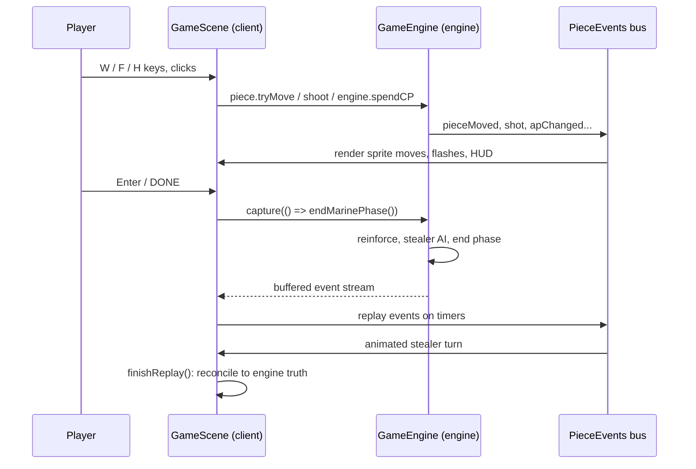

# Architecture and Deployment

How Sulk Web is put together, how the Phaser frontend and the rules engine talk to each other, and how to ship a build. For where to add new content (missions, unit types), see [development-guide.md](development-guide.md). Verified against the source on 2026-08-17; if a detail disagrees with the code, the code wins and this file needs updating.

## The one-paragraph version

Sulk Web is a pnpm monorepo with two packages and a one-way dependency: `packages/client` (Phaser 3 rendering, input, audio, DOM panels) imports `packages/engine` (a pure-TypeScript rules engine with zero rendering dependencies). There is no server and no backend: the engine runs in the browser, in the same JavaScript context as the renderer. The two halves communicate over a narrow boundary: the client calls engine methods and reads engine state; the engine broadcasts what happened on a typed event bus (`PieceEvents`). A production deploy is a static directory.

## Monorepo layout

| Path | What it is |
|---|---|
| `packages/engine/` | `@sulk/engine`: rules, board, pieces, AI, missions. Pure TypeScript, no Phaser, no DOM. |
| `packages/client/` | The playable game: Phaser 3 scenes, DOM roster panel, canvas HUD, audio. Depends on the engine. |
| `scripts/fetchAudio.ts` | Downloads and processes the music and generated sound cuts (see Deployment below). |
| `docs/` | This guide, the [development guide](development-guide.md), the [asset index](asset-index.md), the writing guide, and reference material on the original game. |
| `ISA.md` | The project's system of record: every verified criterion, decision, and piece of test evidence. |

## The engine (`packages/engine`)

The engine models the complete game with no knowledge of how it will be drawn:

- `board/`: `Board`, `Square`, line of sight (`los.ts`), vision and fire arcs (`vision.ts`).
- `pieces/`: `Piece` (abstract base) and its subclasses: `StormBolterMarine` (also the base for `SergeantMarine`, `SwordSergeantMarine`), `HeavyFlamerMarine`, `AssaultCannonMarine`, `ChainFistMarine`, `Genestealer`, `Blip`, `AmbushCounter`. Pieces own their own rules: `tryMove`, `shoot`, `overwatchOn`, and so on, and emit events as they act.
- `rules/`: cross-piece rules: doors (`Door.ts`, edge-model), close combat (`combat.ts`), flame templates (`flame.ts`), exotic objects like the C.A.T. and ducting (`exotic.ts`).
- `GameEngine.ts`: turn structure. `GameEngine` owns the state, deploys the squad from mission JSON, and drives the stealer and end phases (`PhaseName` is a string union; there is no phase-class hierarchy).
- `ai/`: `StealerAI.ts` (blip spawning, hunting, conversion) and `MarineAutopilot.ts` (drives full autoplay games in tests).
- `missions/`: mission JSON files, the `missions` registry, `loadMission`, and the `RawMissionJSON_v2` schema.
- `core/Dice.ts`: the dice abstraction. `SeededRng` and `RollQueue` make any game reproducible, which is what makes the e2e suite deterministic.
- `events/PieceEvents.ts`: the typed pub/sub bus described below.

The engine is fully playable headless: the vitest suite and `MarineAutopilot` run entire missions with no renderer attached.

## The client (`packages/client`)

- `src/main.ts` and `src/gameConfig.ts`: boot a Phaser `Game` with two scenes; `main.ts` also routes the URL — no `?mission=` param mounts the landing overlay (attract mode), a mission param mounts the abort control.
- `src/scenes/PreloadScene.ts`: loading bar. `src/scenes/GameScene.ts`: everything else: reads `?mission=` from the URL, constructs the engine, loads assets, draws the board, translates input into engine calls, and renders engine events.
- `src/ui/`: `HudPanel` (canvas Mission Status strip), `Minimap`, `RosterPanel` (DOM marine cards, keyboard help, credits), `HighlightSprite`, `Selection` (the selected-piece store), `marineNames.ts` (deterministic roster identities), `keyboardHelp.ts` (key layout data), `missionMeta.ts` (curated mission titles/taglines), `HomeOverlay.ts` (the DOM landing screen), `endDialog.ts` (win/loss retry dialog), `abortButton.ts` (two-click abort control).
- `src/audio/`: `AudioManager` (event-driven SFX, per-mission music, motion tracker), `audioManifest.ts` (single source of truth for every audio asset and credit), `alienSegments.ts`, `audioLogic.ts` (pure functions, unit-tested).
- `src/config.ts`: HUD dimensions and colors. `src/utils/cameraBox.ts`: camera-to-minimap projection.
- `src/manual/`: the second Vite page (`/manual.html`) — the field manual. `content.ts` (rules copy transcribed from `docs/rules-reference.md` plus original marine quotes), `missionMapSVG.ts` (renders every mission map as SVG straight from the mission JSON; unit-tested), `main.ts` (page assembly), `manual.css`.
- `src/credits/`: the third Vite page (`/credits.html`) — audio credits. Generated from `src/audio/audioManifest.ts` and `alienSegments.ts` (the same data the fetch script downloads from and the game plays from), one linked row per source video.

One build detail worth knowing: `vite.config.ts` aliases `@sulk/engine` to `../engine/src`. The client compiles the engine's TypeScript source directly, so `pnpm dev` needs no engine build step, and an engine edit hot-reloads the running game. The engine's own `tsc` build (`dist/`) exists for consumers outside Vite, such as running engine code under plain Node.

## The frontend / engine boundary

This is the part to understand before changing anything. There are three channels, and everything crosses through one of them.

### 1. Client calls in: methods and read-only state

`GameScene.init` builds the engine:

```ts
this.engine = new GameEngine(loadMission(missionName), [], dice);
```

From then on, input handlers call engine methods and let events drive the rendering. A `W` keypress becomes `piece.tryMove(dc, dr)`; `F` becomes `piece.shoot(target)`; the DONE button becomes `engine.endMarinePhase()`. The engine validates everything (AP, doors, LOS, occupancy) and returns `false` on refusal, so the client never re-implements a rule.

The client also reads engine state directly: `engine.state.board`, `engine.marines`, `engine.findPiece(id)`, `engine.mission`. These reads are treated as read-only snapshots. The client never mutates engine objects; the only writes go through method calls.

### 2. Engine broadcasts out: `PieceEvents`

`events/PieceEvents.ts` exports a singleton typed emitter. Every gameplay fact the UI could care about is an event with a typed payload: `pieceMoved`, `shot`, `pieceDied`, `doorToggled`, `phaseChanged`, `apChanged`, `cpChanged`, `sectionFlamed`, `blipConverted`, `gameOver`, and about twenty more (the `PieceEventsType` interface is the authoritative list). The engine emits them as rules resolve; `GameScene`, `HudPanel`, `RosterPanel`, and `AudioManager` each subscribe to the slice they render. The engine never knows who is listening; the same events drive the vitest assertions.

### 3. The stealer phase: capture and replay

The engine resolves the entire stealer turn synchronously. `engine.endMarinePhase()` spawns reinforcements, runs the stealer AI, resolves overwatch, ticks mission objectives, clears flames, and re-rolls command points, all in one call. Played raw, the whole enemy turn would appear in a single frame.

So the client records it and plays it back:

```ts
const stream = PieceEvents.capture(() => this.engine.endMarinePhase());
// ... then re-emit each event on a Phaser timer:
this.time.delayedCall(at, () => PieceEvents.replay(ev));
this.time.delayedCall(at + 150, () => this.finishReplay());
```

`capture()` buffers every emission instead of delivering it and returns the ordered stream. `GameScene.endTurn` then replays the stream with per-event pacing, so the player watches blips skitter and shots resolve one at a time, even though the engine finished the turn long ago. Two consequences shape code on both sides:

- `PieceEvents.replaying` is true during playback. Engine handlers that mutate state on events (such as sight-triggered blip conversion) must skip replayed events, or they would re-run rules against the final board mid-animation. View handlers ignore the flag.
- Replayed payloads describe past states, so view code driven by them must not read live engine state mid-replay. When playback ends, `finishReplay()` reconciles everything (roster, HUD, sprites) against engine truth.

### Sequence of one full turn



### Determinism and test hooks

The engine takes an optional `DiceSource`; `SeededRng` and `RollQueue` pin every roll, which the Playwright suite uses to script exact battles. `GameScene` exposes `window.sulk` (engine, scene, `Selection`, autopilot helpers) so e2e tests and debugging sessions can reach both sides of the boundary. Mission selection is a URL parameter: `?mission=space_hulk_3` (unknown values fall back to `debug_1`). A bare URL with no mission param is the homepage: `space_hulk_1` loads as an attract-mode backdrop (input, clock, and audio disabled) under the DOM landing overlay.

## Deployment

There is no server component: a deploy is the Vite build output on any static host (nginx, GitHub Pages, Netlify, S3, anything that serves files).

```bash
pnpm install
pnpm fetch-audio        # optional but recommended: see below
pnpm build              # engine tsc + client vite build
```

The deployable artifact is `packages/client/dist/`: `index.html`, the bundled JS (engine included, via the source alias), and everything from `packages/client/public/` copied verbatim.

Things to know before shipping:

1. **Audio is not in the repo.** `packages/client/public/assets/audio/` (music, generated SFX cuts, alien voices) is gitignored and produced locally by `pnpm fetch-audio` (needs `yt-dlp` and `ffmpeg`; sources and licensing in `CREDITS.md`). Run it before `pnpm build` or the deploy has no music: every audio load is cache-guarded, so the game plays silently rather than breaking. The original Sulk wav set in `assets/sounds/` is committed and always ships.
2. **Host at the domain root, or set a base.** `vite.config.ts` sets no `base`, and asset paths are root-relative, so the build assumes it is served from `/`. To host under a subpath (for example GitHub Pages project sites), add `base: '/your-subpath/'` to `vite.config.ts` and rebuild.
3. **The dev-only 404 middleware does not deploy.** In dev, a custom Vite plugin (`assets404`) makes missing `/assets/*` files return real 404s instead of the SPA fallback page, which Phaser would try to decode as audio. Static hosts return real 404s natively, so no production equivalent is needed. If you ever front the deploy with an SPA rewrite rule, exclude `/assets/` from it for the same reason.
4. **No CI exists.** Build and test locally before shipping: `pnpm test` (engine + client unit suites) and `pnpm --filter ./packages/client e2e` (Playwright, boots its own dev server).

## Verifying a deploy

Open the deployed URL and check: the board renders, `?mission=space_hulk_1` loads a different map, a marine moves with `W`, and (if audio was fetched before the build) music plays after the first click or keypress. All of that exercises the full stack: static hosting, Phaser boot, engine construction, the event bus, and the audio pipeline.
